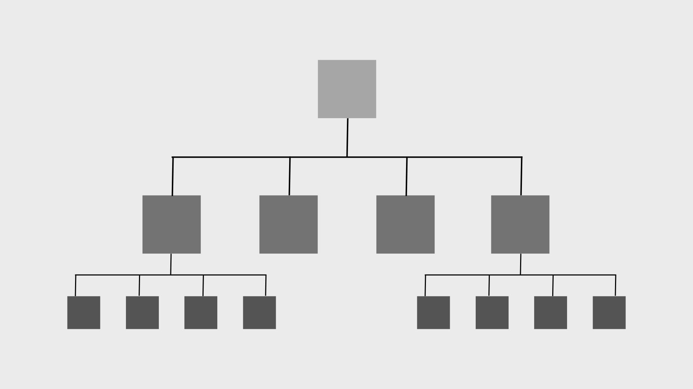

# Collision Detection in 2D Space

This repository contains a C++ implementation of collision detection in a 2D space. The goal is to detect and find all the points that collide with each other. This problem is commonly encountered in various applications such as games, physics simulations, and collision detection.

## Implementation Details

The implementation uses a `QuadTree` data structure to optimize the collision detection process. The QuadTree is a tree data structure in which each internal node has exactly four children. It recursively divides the space into quadrants and stores the points in the corresponding quadrant nodes. This allows for efficient spatial indexing and reduces the number of pairwise collision checks required.



The `Dot` struct represents a point in the 2D space, and the `QuadTreeNode` struct represents a node in the QuadTree. The `constructQuadTree` function constructs the QuadTree recursively by partitioning the space and assigning points to the appropriate nodes. The `check` function checks for collision between two points based on their coordinates. The `checkQuadTree` function recursively checks for collisions within the QuadTree nodes.

## Usage

To use the collision detection implementation, follow these steps:

1. Clone the repository:

   ```shell
   git clone https://github.com/guan404ming/collision-detection.git
   ```

2. Compile the C++ code using a C++ compiler.

3. Run the compiled executable.

## Results and Performance
- To analyze the performance of the QuadTree approach compared to the basic pairwise approach, the program performs multiple tests with different numbers of points. It calculates the average number of collisions detected by each method over a fixed number of iterations.

- The results can be visualized by running the Python script print_data.py, which reads the output data from the tests and plots a line graph comparing the number of collisions detected by the QuadTree approach and the basic pairwise approach for different numbers of points.

- The graph clearly shows that as the number of points increases, the basic pairwise approach requires exponentially more collision checks, resulting in a significant performance decrease. On the other hand, the QuadTree approach exhibits more stable performance with a time complexity of O(n log n), providing a substantial optimization in collision detection.